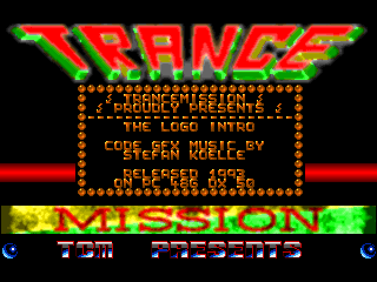
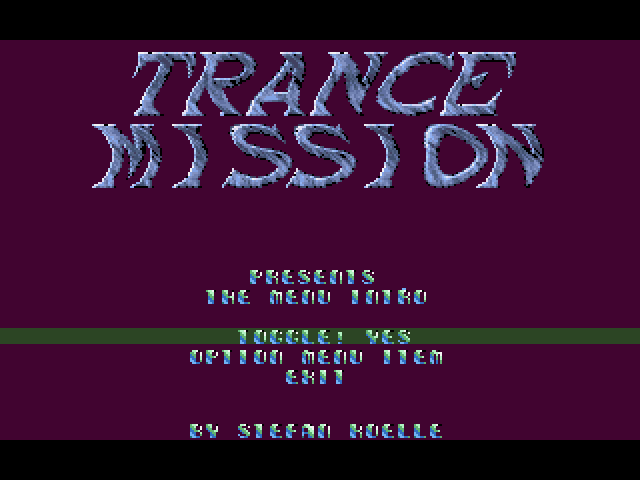
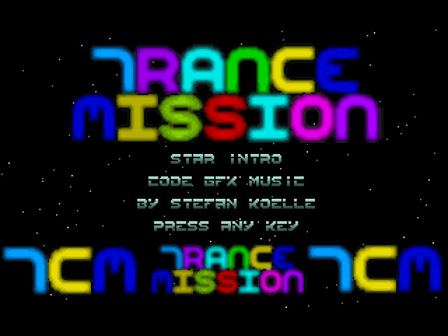

# Trancemission Intros
These demos often showcased advanced graphics, sound, and programming techniques using Turbo Pascal and assembler.

Website: https://www.moonweb.org/tcm/

## Logo Intro

This demo displays animated text and graphics with sound effects. It sets up the graphics mode, clears the screen, and uses the writeline and writeline2 procedures to display text. The animation includes a sine wave effect, and the sound is played if a SoundBlaster card is detected. User interaction allows control of the animation speed and volume, and the demo exits on specific key presses.

Intro on YouTube: https://www.youtube.com/watch?v=i4UOuAOxkn4

## Menu Intro

This demo presents a menu with animated text and graphics. It sets up the graphics mode, clears the screen, and uses the writeline procedure to display text. The animation includes a wobble effect for the logo and text. Sound is played if a SoundBlaster card is detected. User interaction allows navigation through the menu using the keyboard, and the demo exits on specific key presses.

Intro on YouTube: https://www.youtube.com/watch?v=BvKIsfDLH48

## Star Intro

This demo features animated stars and text on the screen, along with sound effects. It initializes the graphics mode, clears the screen, and uses the writeline procedure for text display. Stars are animated to move across the screen, and sound is played if a SoundBlaster card is detected. The demo waits for a key press to exit.

Intro on YouTube: https://www.youtube.com/watch?v=qdtqDdSPuG8

